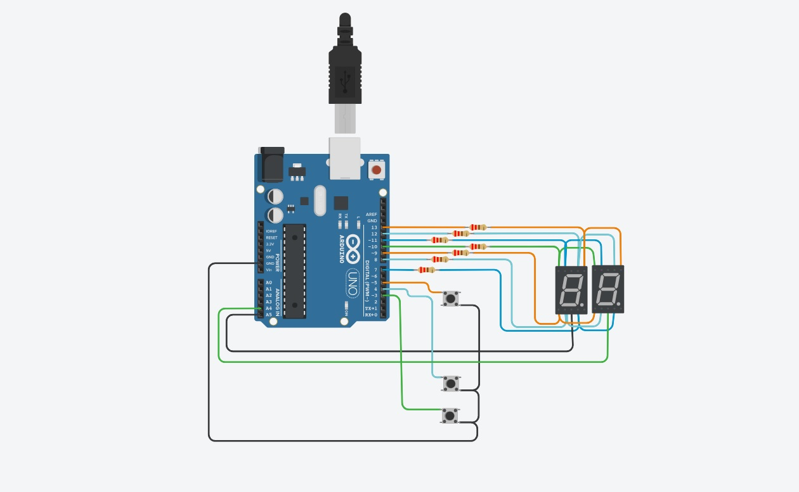
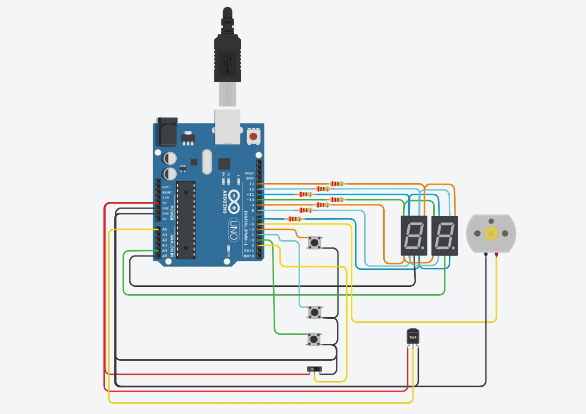
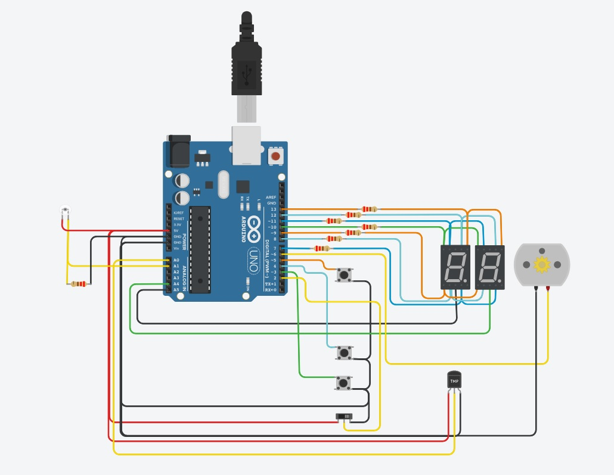

# Parcial Domiciliario :page_facing_up:

## Integrantes
- :cowboy_hat_face: Lucas Espindola
   
---

# Proyecto parte uno: Contador de 0 a 99 con Display 7 Segmentos y Multiplexación

## Descripción

El proyecto realiza un contador de 0 a 99 utilizando dos displays de 7 segmentos donde se implementa la técnica de multiplexación que permite su funcionamiento. Además cuenta con 3 botones que aumenta, disminuye y resetea el contador.

---
~~~ C
void prendeDigito(int digito)
{ 
    if(digito == UNIDAD)
  {
    digitalWrite(UNIDAD, LOW);
    digitalWrite(DECENA, HIGH);
    delay(TIMEDISPLAYON);
  }
   else if(digito == DECENA)
    {
      digitalWrite(UNIDAD, HIGH);
       digitalWrite(DECENA, LOW);
      delay(TIMEDISPLAYON);
    }
      else
      {
        digitalWrite(UNIDAD,HIGH);
        digitalWrite(DECENA,HIGH);
      }
}
~~~
> Funcion que realiza la multiplexación.
---

## :computer: Link al proyecto

- [Parte Uno](https://www.tinkercad.com/things/buAP0c983mY)

---
---

# Proyecto parte dos: Modificación con Interruptor Deslizante y Números Primos

## Descripcion
> **note**
Al proyecto se le agregaron los siguientes componentes: -INTERRUPTOR DESLIZANTE - MOTOR CC - SENSOR DE TEMPERATURA

Se agregó un interruptor deslizante que, depende la posición, permite alternar entre usar un contador normal de 0 a 99 o un contador de números primos en el rango de 0 a 99.
Tambien se agregó la posibilidad de usar un motor de cc, que se enciende a determinada temperatura utilizando el sensor de temperatura y que sube y baja su velocidad solamente utilizando el contador normal. 
Al apagar el motor de cc, se puede seguir utilizando ambos contadores y botones de la misma manera que antes.

### MOTOR DE CC
> El motor de corriente continua sirve para transformar energía eléctrica en energía mecánica, en ese sentido, este tipo de motores puede ser aprovechado en objetos que requieran movimiento.
### SENSOR DE TEMPERATURA
> El TMP36 es un sensor de temperatura que en su salida los proporciona una lectura en grados centígrados de precisión y de bajo voltaje. Se utilizan para medir la temperatura del ambiente.
---
~~~ C
//Función para prender el motor según la temperatura del sensor de temperatura.
void temperaturaControlMotor()
{
  //Asigno en temperatura la funcion map con el valor de temperaturaRead.
	 temperatura = map(temperaturaRead,20,350,-40,125);
  
  if (temperatura > TEMPERATURAMINIMA && temperatura < TEMPERATURAMAXIMA)
    {
    //si cumple con la condicion el motor sube la velocidad a medida que incrementa el contador común
  		analogWrite(MOTOR,contadorDigito);
  	}
  else
  {
    //si no cumple la condicion, el motor permanece apagado o se apaga si estaba en funcionamiento.
  	    analogWrite(MOTOR,LOW);
  }  	  
}
~~~
> Función para prender el motor según la temperatura del sensor de temperatura.
---

## :computer: Link al proyecto parte dos

- [Parte Dos](https://www.tinkercad.com/things/3fFhyDG7J3W)

---
---

# Proyecto parte tres: Modificación según el Último Número de Documento

## Descripcion
> **note**
Al proyecto se le agregó el siguiente componente: - SENSOR DE LUZ AMBIENTAL

Se agregó un sensor de luz ambiental que permite tener el control del circuito. A determinada cantidad de luz, se encienden los display y permite su uso, de lo contrario se apagan los display y el motor en caso de que esté encendido.

### SENSOR DE LUZ AMBIENTAL(FOTOTRANSISTOR)
> Un fototransistor no es mas que un transistor cuya base se expone a la luz a través de una lente cambiando su corriente de base en función de esta luz.
---
~~~ C
//Función para controlar el circuito entero dependiendo de la cantidad de luz ambiental.
void controlLuzAmbiental()
{
  //Aisgno en luz la funcion map con el valor de luzRead.
  luz = map(luzRead,0,154,0,154);
  
  if(luz >= LUZMINIMA && luz <= LUZMAXIMA)
    {
    //Si se cumple la condición,se prenden los display y permite el uso total del circuito.
      posicionInterruptor();
      temperaturaControlMotor();  
    }
  else
    {
    //Cuando no se cumple la condición, se apagan el motor y los display.
        prendeDigito(APAGADOS);
        analogWrite(MOTOR,LOW);
    }
}
~~~
> Función para controlar el circuito entero dependiendo de la cantidad de luz ambiental.
---

## :computer: Link al proyecto parte tres
- [Parte Tres](https://www.tinkercad.com/things/gzIJMUw3nne)

